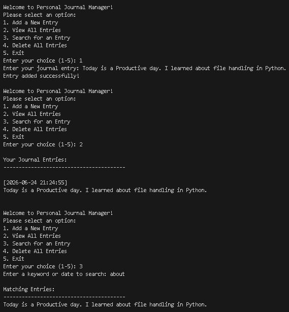
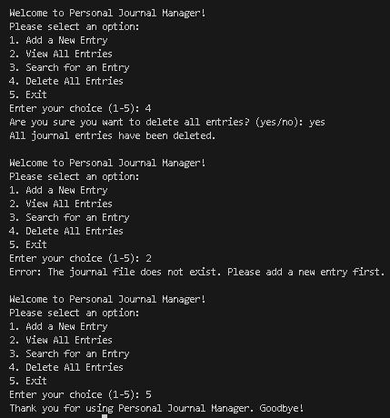

# Personal Journal Manager

## Project Overview

The **Personal Journal Manager** is a Python-based console application designed to help users create and manage personal journal entries efficiently. The project demonstrates Python file handling techniques, object-oriented programming concepts, exception handling, and menu-driven interaction.

The application allows users to write journal entries with timestamps, view previously saved entries, search entries using keywords, and delete stored records through an interactive console interface.

---

## Features

### 1. Add New Journal Entry

* Accepts journal text from the user.
* Automatically records date and time.
* Stores entries in a text file.

### 2. View Journal Entries

Displays all saved journal entries.

Shows:

* Date and timestamp
* Entry content

### 3. Search Journal Entries

Allows users to search entries using:

* Keywords
* Dates
* Partial text matches

### 4. Delete Journal Entries

* Deletes all saved journal entries after confirmation.
* Prevents accidental deletion with user verification.

### 5. Create Journal File

* Uses exclusive file creation mode (`x`).
* Creates a journal file only if it does not already exist.

### 6. Exit Program

* Safely terminates the application.

---

## Concepts Demonstrated

### Built-in Functions

The project uses:

* `input()`
* `print()`
* `open()`
* `read()`
* `readlines()`
* `write()`
* `strftime()`

### User Defined Functions (UDF)

Functions created by the programmer:

* `add_entry()`
* `view_entry()`
* `search_entry()`
* `delete_entry()`
* `create_file_exclusive()`
* `main()`

### Object-Oriented Programming (OOP)

Implemented using:

```python
class JournalManager:
```

### File Handling Modes

Used in:

```python
open(filename, "a")
open(filename, "r")
open(filename, "x")
```

Modes:

* `a` → Append mode
* `r` → Read mode
* `x` → Exclusive file creation mode

### Exception Handling

Used to handle:

```python
FileNotFoundError
PermissionError
FileExistsError
Exception
```

---

## Program Flow

1. User starts the application.
2. Main menu is displayed.
3. User selects an option.
4. Program performs the requested operation.
5. Results are displayed.
6. User can continue using the application.
7. Program exits safely when selected.

---

## Project Structure

```text
Personal-Journal-Manager/
│
├── journal.py
├── journal.txt
├── README.md
├── FT1.png
├── FT2.png
└── DemoVideo.mp4
```

---

## Output Screenshots

### Output 1



### Output 2




---

## 🎥 Project Demo Video

Watch the complete project demonstration here:

[▶ Watch Demo Video][https://drive.google.com/file/d/1wDq5vrSqPXqrSkUraquRwhPMNmfdmz3M/view]
---

## Author

**Sarth Thakar**
